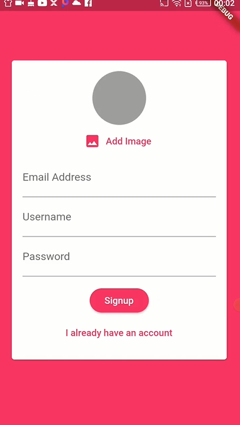

<h1 align="center">Flutter-TheShopApp</h1>
<a href="#">
  <div align="center" >
    
  </div>
</a>

## <h2 align = "center"> [Tap to see the video of this app](https://hirashahid.thecloudsoft.com/flutter-thechatapp/)</h2>

## What I have learnt:
- [x] FirebaseStorage
- [x] Real time streaming of data
- [x] Cloud Storage in Firebase
- [x] Authentication
- [x] Firebase Security Rules
- [x] Uploading Images in Firebase
- [x] Firebase Cloud Messaging 
- [x] Firebase Cloud Functions

## How To Run
```
git clone https://github.com/hirashahid/Flutter-TheChatApp
cd Flutter-TheChatApp
flutter run
```

## Author
You can get in touch with me on my LinkedIn Profile:

#### Hira Shahid
[](https://www.linkedin.com/in/thehirashahid)

You can also follow my GitHub Profile to stay updated about my latest projects: [](https://github.com/hirashahid)

If you liked the repo then kindly support it by giving it a star ⭐!

## LICENSE
- MIT (2021)
